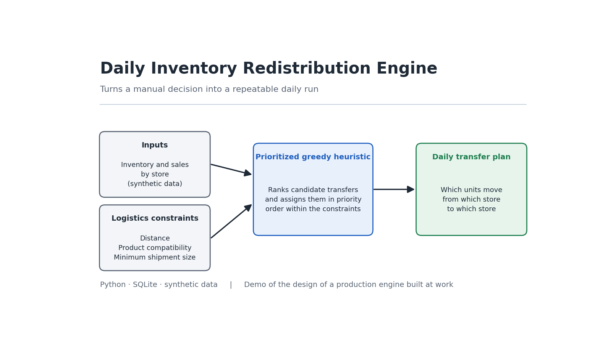

# Inventory Transfer Optimization Engine



Generates the daily inventory redistribution plan for a retail store network: what to move, from where, to where, and in what quantity, respecting the logistical and economic constraints of the operation.

This repository is a **demo reimplementation** of a system I designed and put into production for a chain with about 470 stores nationwide, where it replaced a manual spreadsheet exercise that took one week per month. The code published here is original, uses synthetic data, and contains no company information.

---

## The problem

A store network accumulates two imbalances in parallel:

- Stores with a **shortage**: product that sells but is not on hand at the location
- Stores with an **excess**: product that is left over and does not turn over

Both cost money. A shortage is lost sales; an excess is tied-up capital. The obvious fix is to move merchandise from where there is too much to where there is too little, but moving costs money: freight has to be paid, and a three-unit shipment over eighty kilometers costs more than the goods it carries.

On top of that come constraints that make the naive solution unworkable:

- Not every store can receive every product (an adult-wear store does not sell children's clothing)
- Outlets have finite absorption capacity, and it varies with their actual turnover
- Discontinued product has a different destination than active product
- There is a maximum distance that is operationally reasonable

## The approach

It is a variant of the **transportation problem**. The exact linear-programming solution is expensive to compute at this scale and, more importantly, hard to explain to the people who execute the transfers in the warehouse.

It is solved with a **prioritized greedy heuristic in three stages**, ordered by economic return per unit moved:

### 1. Recovery — Outlet → Regular store

Active product that got stuck in an outlet, where it is sold at a discount, sent back to a store that needs it and can sell it at full price. This is the highest-return stage: it recovers margin that was being lost.

### 2. Rebalancing — Regular store → Regular store

Surplus above the configured maximum moved to stores with a shortage. It does not change the network's total inventory, it only relocates it to where it can sell.

### 3. Evacuation — Regular store → Outlet

Discontinued product occupying floor space in a regular store, sent to the liquidation channel. It is spread across outlets according to their available capacity and with a per-SKU cap, so as not to concentrate thirty units of the same product in a single location.

Each stage consumes from the state left by the previous one: a unit assigned in stage 1 is no longer available for stage 2. This guarantees that no unit is committed twice.

---

## Design decisions

**Geodesic distance computed, not a distance table.** The Haversine formula is applied to each city's coordinates. Maintaining a distance matrix across hundreds of cities is a maintenance problem; computing it takes six lines of trigonometry. Results are cached because the same pairs are queried thousands of times per run.

**Two speed regimes.** Travel time is not linear with distance: a short urban trip is much slower per kilometer than a highway one. The model uses 22 km/h below 45 km and 55 km/h above it.

**Dynamic outlet capacity, not fixed.** Assigning the same cap to every outlet is a costly mistake: it fills up locations that do not turn over and underuses the ones that do. Capacity is derived from actual sales over the last 90 days, projected to the allowed days of coverage, minus current stock.

**Economic filter per origin-destination pair, not per line.** Twenty one-unit lines between the same two stores do fill a bundle and justify the freight, even though each line alone looks insignificant. Filtering line by line would discard perfectly viable shipments.

**Nearest-origin selection.** When several stores can cover a shortage, the nearest one wins. It is greedy and does not guarantee the global optimum, but it produces plans that a logistics coordinator understands and can audit, which in practice is worth more than an optimum nobody can explain.

---

## Running it

Requires Python 3.10 or higher.

```bash
pip install -r requirements.txt

python generar_datos.py     # creates inventario.db with synthetic data
python motor_traslados.py   # generates plan_traslados.csv
```

Example output:

```
Cargando inventario...
  7820 filas de inventario en 120 tiendas
Generando plan...
Filtros: 665 -> 153 lineas (512 descartadas)

Plan exportado a plan_traslados.csv
Lineas:   153
Unidades: 546

Por prioridad:
                lineas  unidades
1-RECUPERACION      95       275
2-REBALANCEO         9        31
3-EVACUACION        49       240
```

The program's console output is in Spanish, as in the original system. Having 512 of 665 lines discarded is the correct behavior: those are transfers the economic filter considers unviable. Without that filter, the plan would send the warehouse to build hundreds of shipments that cost more than they move.

---

## Structure

| File | Contents |
|---|---|
| `ciudades.py` | Coordinates and geodesic distance calculation |
| `generar_datos.py` | Generates the fictitious network and inventory in SQLite |
| `motor_traslados.py` | Loading, three-stage algorithm, filters and export |

---

## Adjustable parameters

In `motor_traslados.py`:

| Parameter | Value | Effect |
|---|---|---|
| `DIAS_COBERTURA_OUTLET` | 60 | Days of inventory an outlet can absorb |
| `MAX_UNIDADES_SKU_POR_OUTLET` | 5 | Per-SKU cap to avoid saturating one location |
| `MIN_UNIDADES_POR_ENVIO` | 10 | Minimum units per origin-destination pair |
| `MAX_KM_TRASLADO` | 100 | Maximum operationally reasonable distance |

These values are examples. In a real implementation they are calibrated against freight cost and the operation's lead times.

---

## Possible extensions

- Explicit freight cost per leg, instead of distance as a proxy
- Comparison against an exact linear-programming solution on small subsets, to measure how far the heuristic lands from the optimum
- Shipment consolidation by route, grouping destinations along the same corridor

---

## License

MIT
